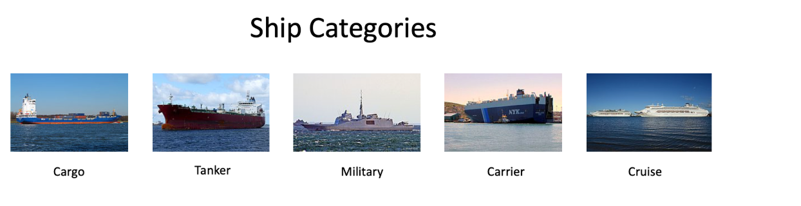

# AV Game Of Deep Learning
Game of Deep Learning Hackathon hosted by AV.

# Problem Statement
Ship or vessel detection has a wide range of applications, in the areas of maritime safety,  fisheries management, marine pollution, defence and maritime security, protection from piracy, illegal migration, etc.

Keeping this in mind, a Governmental Maritime and Coastguard Agency is planning to deploy a computer vision based automated system to identify ship type only from the images taken by the survey boats. You have been hired as a consultant to build an efficient model for this project.

There are 5 classes of ships to be detected which are as follows:

## Dataset Description
There are 6252 images in train and 2680 images in test data. The categories of ships and their corresponding codes in the dataset are as follows -

{'Cargo': 1,
'Military': 2,
'Carrier': 3,
'Cruise': 4,
'Tankers': 5}

## Evaluation Metric
The Evaluation metric for this competition is **weighted F1 Score**

## Public and Private Split
Public leaderboard is based on randomly selected 30% of the test images, while private leaderboard will be evaluated on remaining 70% of the test images.

# Approach
1. Extract features using pre-trained CNNs
2. Finetuning VGG19 using Keras
3. Finetuning Resnet152 using FastAI
4. Finetuning Resnet101 using FastAI (best score on leaderboard)

# Leaderboard

Public Leaderboard | Private Leaderboard
------------------ | -------------------
0.948616073049413 | 0.945167592997902
